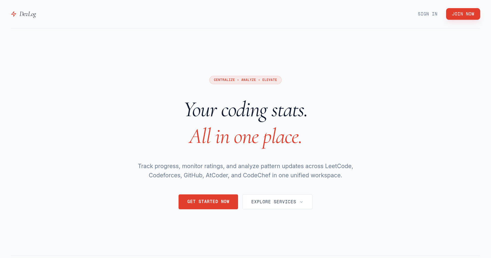
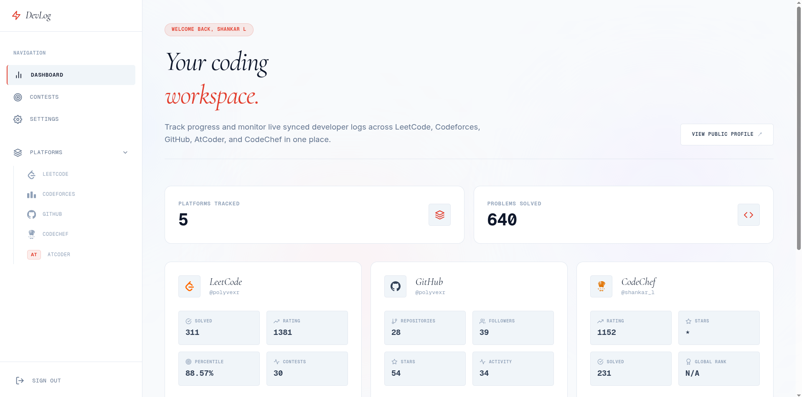
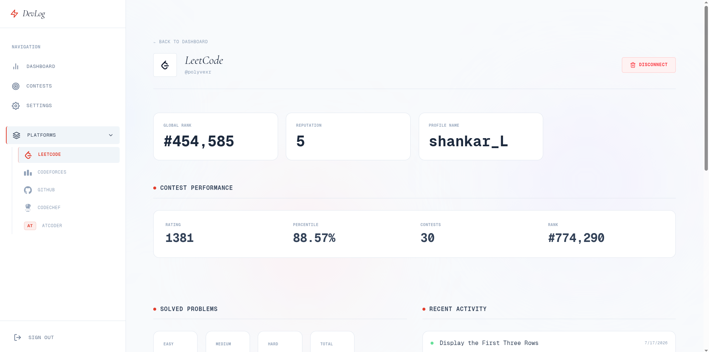
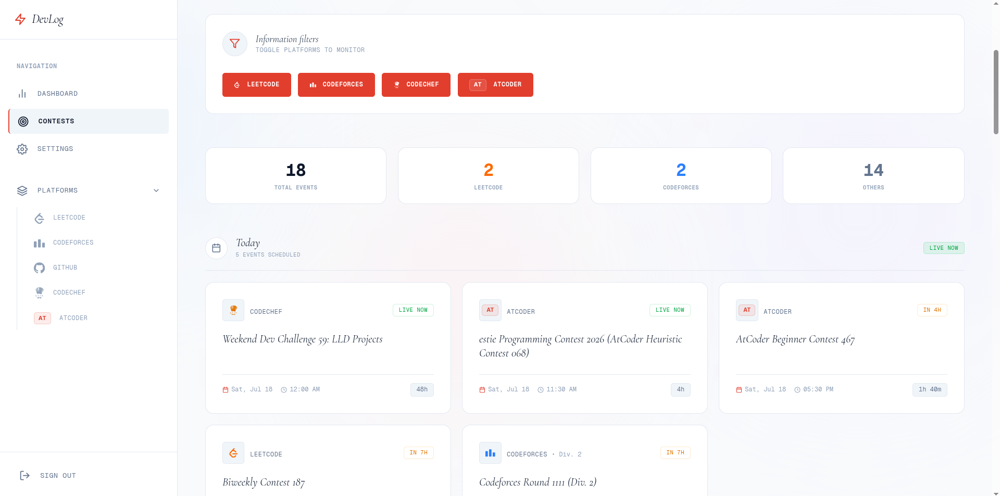
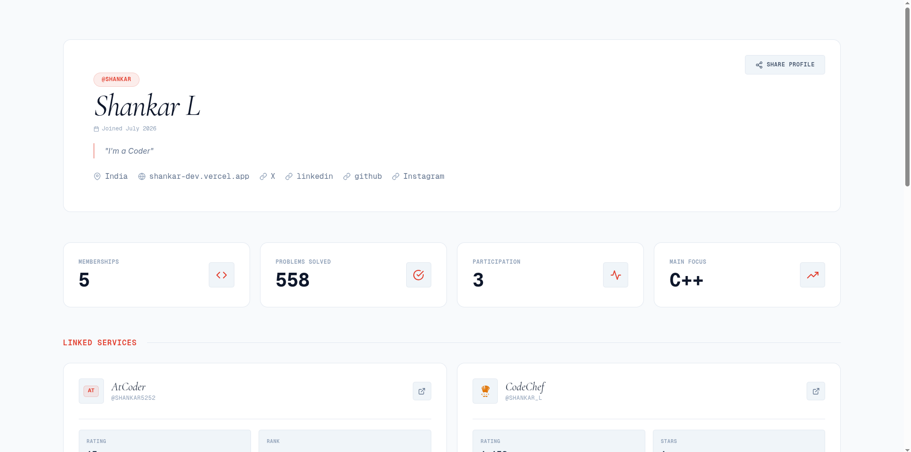
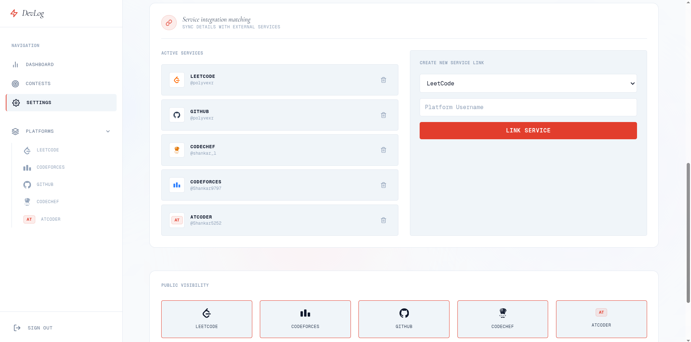

# DevLog - Professional Skill Record Tracker

DevLog is a premium professional skill record tracker that combines progress information from multiple programming websites into a single overview center. Track your progress on LeetCode, Codeforces, GitHub, AtCoder, and CodeChef in one place.

Live Demo: https://my-devlog.vercel.app

***

## Screenshots

### Pages

| Landing Page | Dashboard | Platform Profiles |
| - | - | - |
|  |  |  |

| Competition Schedule | Public Profile | Settings |
| - | - | - |
|  |  |  |

***

## Features

### Authentication
- Secure token-based entry, registration, and account recovery
- Persistent sessions and secure identity verification

### Single Overview Area
- Consolidate information from LeetCode, Codeforces, GitHub, AtCoder, and CodeChef in one place
- Track progress across multiple programming platforms

### Competition Schedule
- Stay updated with upcoming events across all services
- Standard information interface for contest schedules

### Open Profiles
- Share your professional journey with a customizable shared page link
- Publicly visible profile showing coding achievements

### Settings and Management Center
- Permission-based access to manage members
- Trigger manual information matching and update profile configurations

### Notifications
- Automated email messages for account resets
- Optional alerts via messaging services

***

## User Guide

This README serves only as a user guide. For developer setup and technical details, please refer to DOCUMENTATION.md.

Follow these steps to track your progress:

1. **Register**: Click get started on the landing page to create your account.
2. **Login**: Sign in using your email and password.
3. **Dashboard**: View your skill overview and your unique shareable link.
4. **Platforms**: Link your accounts from LeetCode, Codeforces, GitHub, AtCoder, and CodeChef to sync your profiles.
5. **Contests**: Check the contests tab to see upcoming programming competitions.
6. **Settings**: Manage your profile settings, privacy preferences, and notifications.
7. **Share**: Copy your public profile link from the dashboard to share with others.

***

## Development Guide

Please note that this document is only a user guide. The development setup, API references, architecture, and other technical documentation will be updated later in DOCUMENTATION.md.

***

## Contributions

Contributions are welcome. Please fork the repository and submit a pull request with your changes.